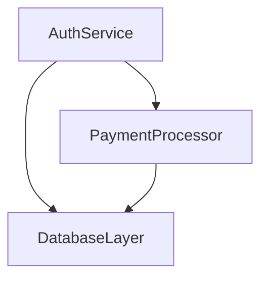

AI is writing more of our code every day. You leave an agent running, come back, and who knows what's changed. Having a map helps.

The problem is most AI-generated diagrams are useless. Boxes labeled "AuthService" and "DatabaseLayer" — but click on them and nothing happens. You can't tell if "PaymentProcessor" is a class, a file, or something the model hallucinated.

The fix is simple: **ground every node in actual code**. Each box maps to a file and line range. Now the diagram isn't decoration — it's a navigation surface.

## The prompt

Here's what works. Paste this into Claude Code, Amp, Cursor, or any coding agent:

```
Please generate a mermaid diagram (in a .mmd file) that shows this codebase as an ontology. Make it comprehensive.

Every single node should be groundable in a specific line of code, set of lines from a file, or sets of lines from multiple files.

Generate that mapping as well and put it in a separate .naiad file — a JSON object where keys are node IDs and values are objects with "file" and "lines" properties.
```

The key insight: by asking for the grounding file separately, you force the agent to actually verify each node corresponds to real code. No more hallucinated boxes.

## What you get

Two files. First, a standard Mermaid diagram:



Second, a grounding file that maps each node to code:

```json
{
  "auth": {
    "file": "src/auth/service.ts",
    "lines": [1, 145]
  },
  "db": {
    "file": "src/db/index.ts",
    "lines": [1, 89]
  },
  "pay": {
    "file": "src/payments/processor.ts",
    "lines": [12, 203]
  }
}
```

## Three ways to use this

### 1. Paste the prompt

Copy the prompt above into any coding agent. Works immediately.

### 2. Shell alias

Add this to your shell config for one-command diagrams:

```bash
alias diagram='claude -p "Generate a mermaid diagram (.mmd) showing this codebase as an ontology. Every node must map to real code. Generate a .naiad file with the grounding: JSON object, keys are node IDs, values have file and lines properties."'
```

Replace `claude` with `amp` or your agent of choice.

### 3. Agent skill (Amp/Claude Code)

For agents that support skills, create a `SKILL.md` file in your repo:

```markdown
---
name: diagram
description: Generate a grounded codebase diagram
---

Generate a comprehensive mermaid diagram showing this codebase as an ontology.

Requirements:
- Output a .mmd file with the Mermaid diagram
- Every node must correspond to actual code
- Output a .naiad file with grounding metadata
- The .naiad file is JSON: keys are node IDs, values are {file, lines}

Start by exploring the codebase structure, then build the diagram iteratively.
```

## Why this works

Most "diagram my codebase" prompts fail because they don't constrain the output. The agent draws whatever looks reasonable, with no accountability.

By requiring a separate grounding file, you create a verification mechanism. The agent has to commit to specific file paths and line numbers. If it can't find real code to back a node, it either drops the node or the discrepancy becomes obvious.

The result: diagrams you can actually use to navigate a codebase, not just admire once and forget.
